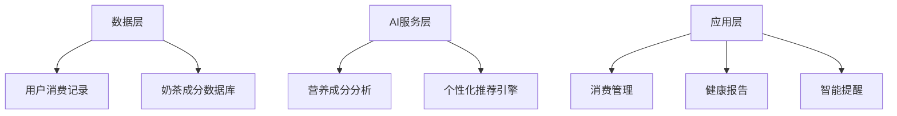
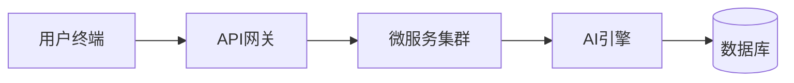

# AI智能奶茶记账软件 产品需求文档（PRD）
**版本号：v1.0**

## 一、产品概述
### 1.1 目标用户
- 奶茶消费高频用户（18-35岁年轻人）
- 健康管理意识较强的人群
- 需要控制预算的奶茶爱好者

### 1.2 核心价值
- **消费透明化**：自动记录奶茶消费金额与营养数据
- **健康量化**：通过AI算法实现卡路里/咖啡因摄入可视化
- **智能决策**：基于用户目标提供个性化消费建议

## 二、功能模块及技术实现
### 2.1 核心功能架构

### 2.2 功能模块详情
#### 模块1：智能账单管理
- 功能描述：
支持微信/支付宝账单自动导入（需用户授权）
手动录入模式：选择品牌→奶茶名称→规格→自定义参数
消费数据可视化（周/月消费趋势图）

- 技术实现：
前端：Vue3 + ECharts 图表库
后端：Node.js账单解析服务
数据存储：MongoDB（非结构化账单数据）
#### 模块2：AI营养分析
- 功能描述：
预置800+款奶茶成分数据库（覆盖主流品牌）
智能匹配：根据奶茶名称自动填充营养成分
自定义计算器：支持调整甜度/规格后的动态计算
- 技术实现：
数据采集：Python+Scrapy框架爬虫 + 品牌API对接
AI模型：BERT-NER非结构化文本解析
#### 模块3：健康管家
- 功能描述：
阈值预警：当日摄入量超过标准值时推送提醒
智能推荐：预算/健康/睡眠多维决策
- 技术实现：
推荐算法：协同过滤+规则引擎
数据整合：Apple Health/华为健康接口对接

## 三、技术选型
### 3.1 技术栈
层级	技术方案
前端	Vue3 + Vite + TypeScript
后端	NestJS + TypeORM
数据库	PostgreSQL + Redis
AI服务	PyTorch + ONNX Runtime

### 3.2 技术架构

